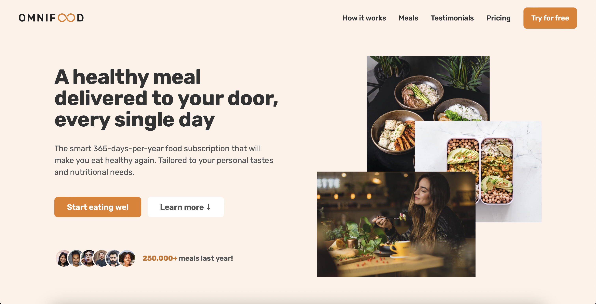
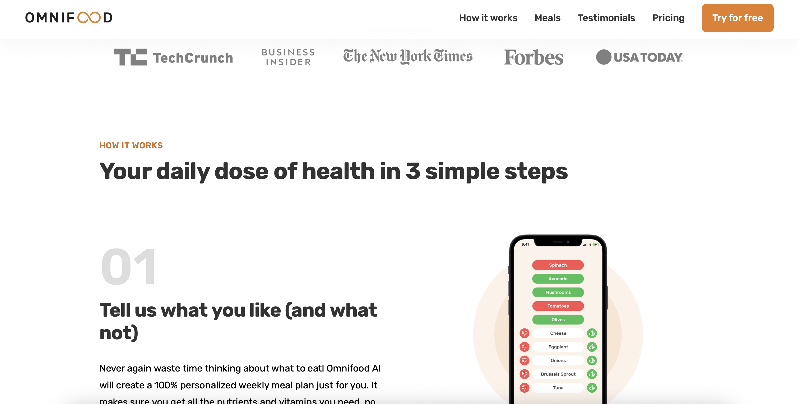

# Omnifood

## Description

This project is a landing page of Omnifood company, which is a fictional meal-delivery startup. The page is well-structured and is fully responsive for different screen sizes.

The project was made while taking of **["Build Responsive Real-World Websites with HTML and CSS"](https://www.udemy.com/course/design-and-develop-a-killer-website-with-html5-and-css3/)** udemy course.

## Screenshots

